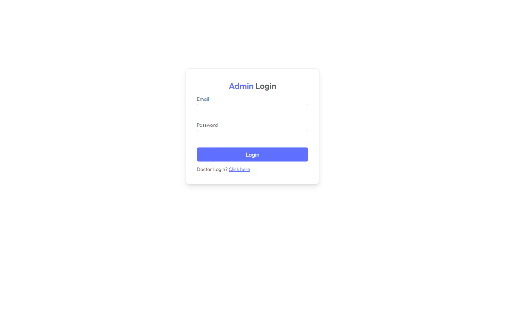

# 🏥 PrimeCare - Doctor Appointment System

PrimeCare is a full-featured web application for managing doctor appointments, built with React for the frontend, Node.js/Express for the backend, and a separate admin dashboard. It allows patients to book appointments, doctors to manage their schedules, and admins to manage users and appointments.

---

- **Frontend (Patient):** [https://primecare-frontend.onrender.com](https://primecare-frontend-u848.onrender.com)  
- **Admin Dashboard:** [https://primecare-admin.onrender.com](https://primecare-admin-pkpn.onrender.com)  

## 🌟 Features

### User (Patient) Frontend
- User registration and login
- Browse available doctors
- Book appointments
- View upcoming and past appointments
- Update user profile

### Doctor Dashboard
- Doctor login
- View scheduled appointments
- Update profile and availability
- Manage patient interactions

### Admin Dashboard
- Admin login
- Manage doctors (add, edit, remove)
- Manage patients
- View all appointments
- Dashboard analytics

---

## 🛠️ Technologies Used

- **Frontend:** React, Tailwind CSS, Axios, React Router DOM, React Toastify
- **Admin Panel:** React, Tailwind CSS, Axios, React Router DOM
- **Backend:** Node.js, Express.js, MongoDB, Mongoose
- **Authentication:** JWT, bcrypt
- **Deployment:** Render / Vercel

---

## 🧩 Usage

 - Start backend and ensure MongoDB is running.
 - Launch frontend and admin panel separately.
 - Create accounts for patients, doctors, and admins.
 - Book appointments as a patient, manage them as a doctor, and oversee everything as an admin.

## 🔐 Authentication

 - JWT-based authentication for patients, doctors, and admins.
 - Protected routes for dashboards and sensitive operations

## 🖼️ Screenshots

### Landing Page

| Banner | Top Doctors | Select Doctor |
|--------|-------------|---------------|
|  |  |  |

### User Login & Admin Login

| User Login | Admin Login |
|-------------|----------------|
|  |  |

### Admin Dashboard & Doctor Dashboard

| Doctor Dashboard | Doctor Profile |
|-----------------|----------------|
|  |  |

